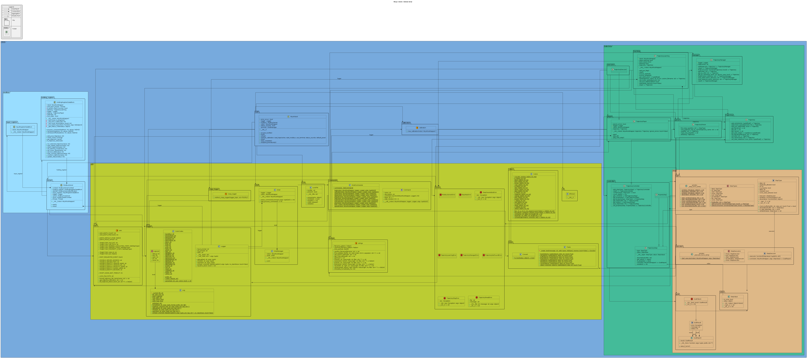
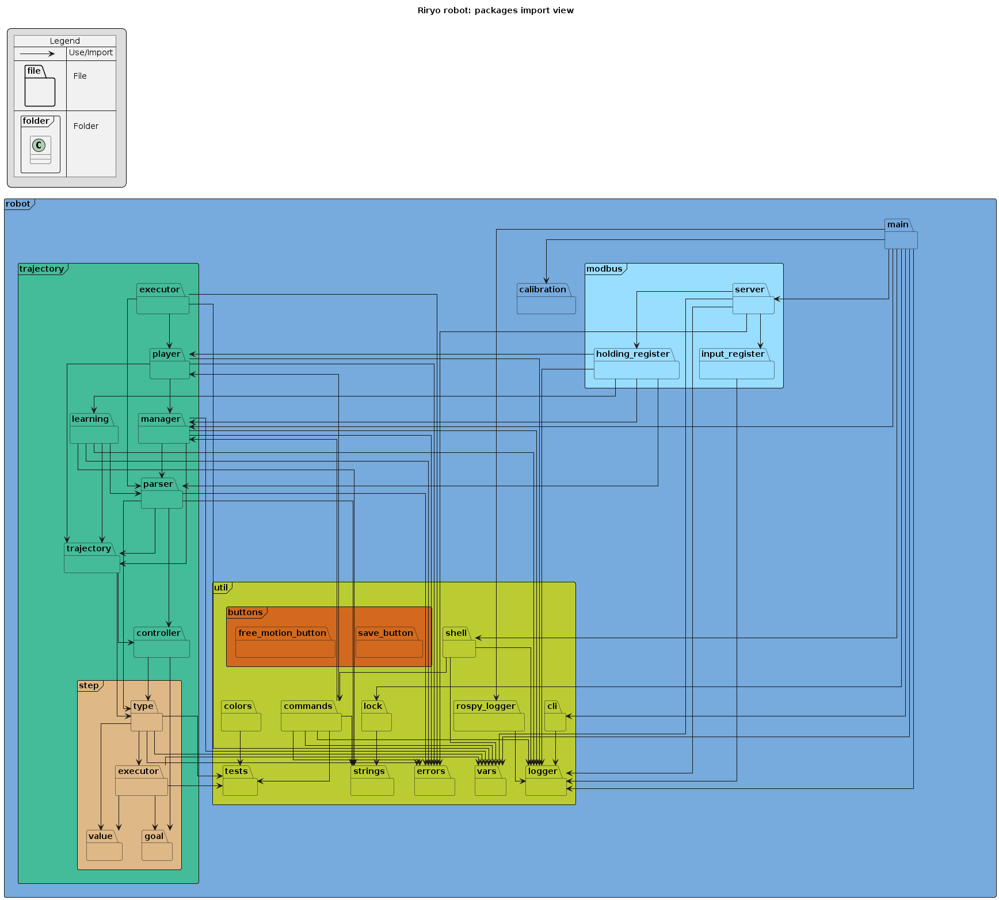
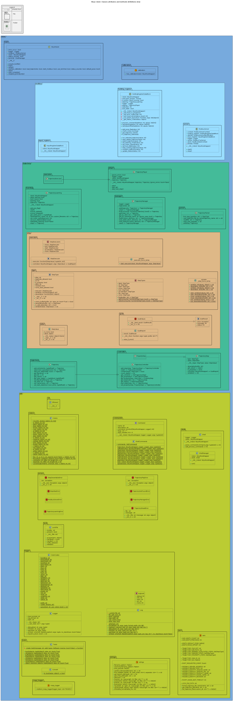
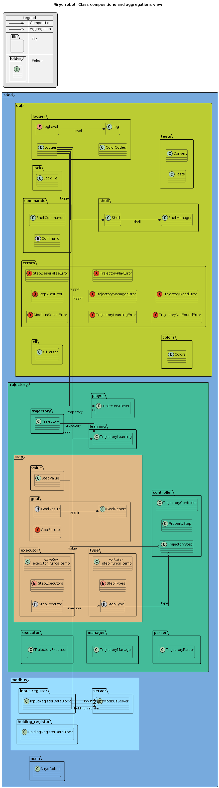

# UML diagrams

### Use-case diagram

### *** diagram

### Class diagrams

**Global view:**  
* [PlantUML code](puml/global-view.puml)
* 

  
Generated image

  
  

**Packages importations:**  
* [PlantUML code](puml/packages-import-view.puml)
* 

  
Generated image

  
  

**Classes attributes and methods definitions:**  
* [PlantUML code](puml/classes-attributes-view.puml)
* 

  
Generated image

  
  

**Classes fields:**  
* [PlantUML code](puml/source-fields-view.puml)
* 

  
Generated image

  
  

